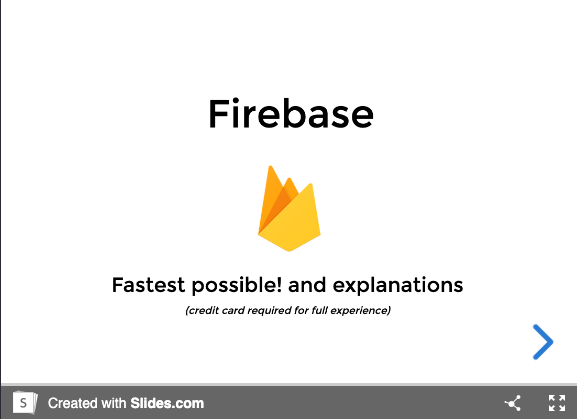

# Firebase workshop
> Example application made with Next.js + Firebase SDK

[Service Account Google Doc](https://docs.google.com/document/d/1UDPgJ6vARZjNL8u4fOUEQWGlYqHcBGmoZbxCrZXLsmY/edit?usp=sharing)

[](https://slides.com/santospatrick/firebase)

## Setup
```bash
# first terminal
yarn
yarn dev

# second terminal
cd functions
yarn serve # for emulators

# third terminal
yarn build # for typescript
```